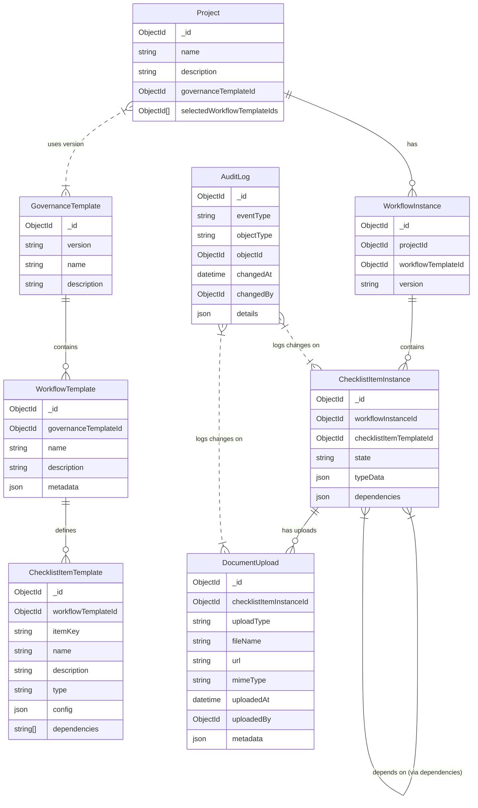

## Updated Data Model

### 1. GovernanceTemplate
Represents a version-controlled snapshot of the overall governance process.  
**Fields:**
- `_id`
- `version` (e.g., `"1.0.0"`)
- `name`
- `description`

### 2. WorkflowTemplate
A specific workflow (or sub‑workflow) that is part of the governance process.  
**Fields:**
- `_id`
- `governanceTemplateId` – reference to the parent GovernanceTemplate
- `name`
- `description`
- `metadata` – a JSON object describing criteria (e.g., which business areas it applies to)

### 3. ChecklistItemTemplate
A checklist item defined as part of a WorkflowTemplate. It supports different types (e.g., `"approval"`, `"document"`, `"event"`) using a flexible structure.  
**Fields:**
- `_id`
- `workflowTemplateId` – reference to the parent WorkflowTemplate
- `itemKey` – a unique identifier (within the governance template) so that dependencies can be referenced across workflows
- `name`
- `description`
- `type` – one of: `"default"`, `"approval"`, `"document"`, `"event"`, etc.
- `config` – any extra configuration (for example, for `"approval"` you might note that a document upload is required)
- `dependencies` – an array of dependency definitions. Each entry can reference another checklist item (by `itemKey` or `_id` of a ChecklistItemTemplate)

### 4. Project
A project that will follow a given version of the governance template (i.e., a snapshot of the template).  
**Fields:**
- `_id`
- `name`
- `description`
- `governanceTemplateId` – the version-controlled GovernanceTemplate used by the project
- `selectedWorkflowTemplateIds` – an array of WorkflowTemplate `_id`s indicating which workflows apply to the project

### 5. WorkflowInstance
A snapshot instance of a WorkflowTemplate for a given project.  
**Fields:**
- `_id`
- `projectId` – reference to the parent Project
- `workflowTemplateId` – the source WorkflowTemplate
- `version` – snapshot version (copied from the WorkflowTemplate/GovernanceTemplate)

### 6. ChecklistItemInstance
An instance of a checklist item for a given WorkflowInstance. This document mirrors the ChecklistItemTemplate and holds runtime state plus type‑specific data.  
**Fields:**
- `_id`
- `workflowInstanceId` – reference to the parent WorkflowInstance
- `checklistItemTemplateId` – reference to the source ChecklistItemTemplate
- `state` – one of: `"incomplete"`, `"complete"`, `"not required"`
- `typeData` – a JSON object to store type‑specific data (e.g., for an `"approval"` type: `{ approver, approvedAt }`)
- `dependencies` – an array of dependency objects. Each object contains:
  - `dependencyInstanceId` – reference to another ChecklistItemInstance that must be complete
  - `active` – a boolean flag indicating if this dependency is enforced in the current project context

### 7. DocumentUpload
A new collection to track file uploads for checklist item instances.  
**Fields:**
- `_id`
- `checklistItemInstanceId` – reference to the associated ChecklistItemInstance
- `uploadType` – a string to differentiate the nature of the document (e.g., `"approvalEvidence"`, `"documentFile"`, etc.)
- `fileName` – the original name of the file (or a designated name)
- `url` – a link to the uploaded file (e.g., an S3 URL or similar)
- `mimeType` – the MIME type of the file
- `uploadedAt` – timestamp when the file was uploaded
- `uploadedBy` – reference to the user who uploaded the file
- `metadata` – (optional) any additional metadata related to the file

### 8. AuditLog
A separate, immutable collection that records every important event (such as checklist item state changes or when an item is marked "not required" with an explanation).  
**Fields:**
- `_id`
- `eventType` – e.g., `"stateChange"`, `"dependencyOverride"`, etc.
- `objectType` – e.g., `"ChecklistItemInstance"`, `"DocumentUpload"`
- `objectId` – the affected document's `_id`
- `changedAt` – timestamp
- `changedBy` – identifier for the user who made the change
- `details` – a JSON object containing additional details (for example, previous state, new state, explanation text)

---

## Updated Mermaid ER Diagram

Below is the updated Mermaid diagram showing the relationships between the entities, including the new **DocumentUpload** collection:

---

## How This Updated Model Meets the Requirements

- **Multiple Document Uploads:**  
  The new **DocumentUpload** collection allows each **ChecklistItemInstance** to have multiple associated uploads. Each document record can include details such as file name, URL, MIME type, upload timestamp, and uploader, ensuring that various document types (e.g., evidence, approvals, other documents) are supported.

- **Flexible Association:**  
  Document uploads are linked via the `checklistItemInstanceId` field, meaning that any checklist item requiring evidence can reference one or more uploads without complicating the checklist item document itself.

- **Audit and Traceability:**  
  Changes related to uploads (if needed) can be recorded in the **AuditLog** collection, keeping a full audit trail of changes and additions across the system.

- **Type‑Specific Data Remains Flexible:**  
  The **ChecklistItemInstance** still contains a `typeData` field to handle additional properties specific to each item type (while file uploads are managed separately).

---

## Application Overview

Below is a summary of what the governance checklist application will do for users once it's fully implemented:
* **Centralized Governance Management:** Users can select a version-controlled governance template that outlines the overall process for their project. This template includes multiple workflows (and sub-workflows) that break down the governance process into manageable parts.
* **Customizable Checklists:** Each workflow contains a checklist of items that users must complete. These items can vary by type—for example, general tasks, approvals (which require document uploads and approval metadata), documents (for updating or uploading necessary files), and events (with scheduling and completion tracking).
* **Dynamic Dependency Enforcement:** Checklist items can have dependencies on other items—even across different workflows. This means that users won't be able to mark an item as complete until all its prerequisite tasks have been addressed. The app intelligently manages these dependencies and allows for some to be marked inactive if a particular workflow isn't in use for a project.
* **Robust Document Management:** For checklist items that require supporting evidence or documentation, users can upload multiple files. The system supports various document types, storing metadata (such as file name, URL, MIME type, and upload timestamps) to ensure every piece of evidence is properly tracked.
* **Real-Time Status & Audit Logging:** Each checklist item has a state (such as "incomplete," "complete," or "not required"), and any change in state is automatically recorded in a detailed audit log. This ensures that every action—from marking an item complete to providing a reason for skipping an item—is traceable, supporting compliance and accountability.
* **Project-Specific Snapshots:** When a project is created, it takes a snapshot of the selected governance template. This snapshot ensures that even if the overall governance template is updated later, existing projects maintain their original configuration, while new projects can benefit from the latest version.
* **User-Friendly Workflow & Compliance Tool:** The application guides users through a series of steps tailored to their project's specific needs. By integrating multiple workflows, document uploads, dependency checks, and audit trails, it simplifies complex governance processes, making it easier for teams to maintain compliance and track progress.

In essence, the application is designed to streamline and standardize governance processes, making it easier for organizations to manage approvals, documentation, and compliance tasks through a structured, transparent, and auditable system.

## Application workflow

### 1. **Templates: The Blueprint**

- **GovernanceTemplate:**  
    This is the master blueprint of the entire governance process. It’s version-controlled, meaning that when changes are made, a new version is created. Each GovernanceTemplate defines the overall process that a project might follow.
    
- **WorkflowTemplate:**  
    Within a GovernanceTemplate, you have one or more WorkflowTemplates. Each of these represents a distinct process or sub-process (for example, “Main Approval Process” or “Document Review Sub-Process”). They include metadata that helps determine when and where each workflow should be applied.
    
- **ChecklistItemTemplate:**  
    Every WorkflowTemplate contains several ChecklistItemTemplates. Each checklist item defines a task (like “Upload approval document” or “Confirm event scheduling”) along with its type, configuration, and any dependencies on other checklist items (even across workflows). These are all defined as part of the blueprint for how governance should be executed.
    

---

### 2. **Projects: Instantiating the Blueprint**

When a user (or an administrator) creates a new project:

- **Project Creation:**  
    The user selects a specific version of a GovernanceTemplate that applies to the project. This selection ensures that the project will follow the processes as defined at that point in time, regardless of any future changes to the template.
    
- **Workflow Selection:**  
    The user then picks which WorkflowTemplates from the selected GovernanceTemplate are relevant for their project. This allows the project to ignore workflows that are not applicable to its particular circumstances.
    

---

### 3. **Instances: Bringing Templates to Life**

- **WorkflowInstance:**  
    For each WorkflowTemplate selected for the project, a corresponding WorkflowInstance is created. Think of a WorkflowInstance as a “live” copy of the workflow that the project will use. It captures the state of the workflow at the time of instantiation.
    
- **ChecklistItemInstance:**  
    For each ChecklistItemTemplate within the selected WorkflowTemplates, a ChecklistItemInstance is created within the corresponding WorkflowInstance. These instances:
    
    - **Mirror the Template:** They copy over the defined task, type, and dependencies.
    - **Maintain State:** They have fields for tracking current state (e.g., “incomplete”, “complete”, “not required”) and include a flexible `typeData` field to hold extra information (like document upload details or event scheduling data).
    - **Manage Dependencies:** They reference other checklist item instances based on the template dependencies, with each dependency flagged as active or inactive depending on whether it applies in the project context.
- **DocumentUpload (if applicable):**  
    For checklist items that require document evidence or approval, users can attach multiple DocumentUpload records to the ChecklistItemInstance. Each DocumentUpload contains metadata about the file, such as URL, file type, upload timestamp, and uploader.
    

---

### 4. **Why This Workflow Matters**

- **Snapshotting for Stability:**  
    When a project is created, it takes a “snapshot” of the governance process as defined by the templates. This means that even if the GovernanceTemplate is updated later, existing projects continue to operate with the version they were instantiated with. This isolation protects ongoing projects from unexpected changes.
    
- **Customized Process per Project:**  
    The user can select which workflows apply to their project. During the instantiation process, only the relevant workflows and checklist items are activated. Dependencies are also adjusted (active vs. inactive) based on which items are present in the project’s instance.
    
- **Auditability and Traceability:**  
    As the project progresses, any changes to the checklist items (such as marking them complete, uploading documents, or noting dependencies) are logged in a separate AuditLog. This ensures that every step is traceable, which is critical for compliance and governance.
    
- **Flexibility and Evolution:**  
    Because the templates are maintained separately from the instances, you have the flexibility to evolve the governance process over time. New projects can adopt the latest templates, while ongoing projects remain stable.
    

---

### **Summary of the Flow**

1. **Define the Blueprint:**  
    Administrators create version-controlled GovernanceTemplates that include WorkflowTemplates and ChecklistItemTemplates.
    
2. **Select for the Project:**  
    When setting up a new project, the user selects the appropriate GovernanceTemplate version and chooses the relevant workflows.
    
3. **Instantiate for Use:**  
    The system creates WorkflowInstances and ChecklistItemInstances as snapshots of the templates for that project. These instances are then used for tracking progress, managing dependencies, and handling document uploads.
    
4. **Ongoing Management and Audit:**  
    As users interact with the project’s checklist items (completing tasks, uploading documents, etc.), each action is recorded both in the instance data and in the AuditLog, ensuring a transparent, auditable process.
    

---

This workflow ensures that the governance process is both standardized across projects (through the templates) and flexible enough to meet the specific needs of each project (through the instances), all while maintaining a robust audit trail.
