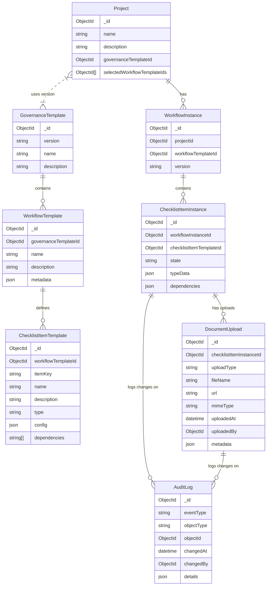

# Governance Checklist Application PRD

## 1. Overview

### Purpose:
The Governance Checklist Application is designed to help organizations manage and track their governance processes through a unified checklist. The application provides a version-controlled template system for governance workflows and checklist items, ensuring that projects can follow a defined process while accommodating business-specific variations. It also supports document uploads, dependency management across workflows, and detailed audit logging.

### Key Stakeholders:
- Governance Administrators: Responsible for creating and maintaining governance templates, workflows, and checklist item definitions.
- Project Administrators: Responsible for creating new projects by selecting relevant workflows and checklist items from the approved governance templates.
- End Users: Use the checklist interface to mark tasks complete, upload supporting documentation, and view progress across workflows.

## 2. Background & Objectives

### Background
The current governance process across projects is fragmented. There is a need to:
- Standardize the governance process with a version-controlled model.
- Allow flexibility so that each project can pick and choose which workflows and checklist items are applicable.
- Ensure that dependencies between checklist items (even across different workflows) are managed effectively.
- Maintain a robust audit trail for compliance purposes.

### Objectives
- Centralized Governance Management: Enable governance admins to define, version, and update governance workflows and checklist items.
- Project-Specific Configurations: Allow project admins to instantiate projects using a snapshot of the selected governance template.
- User-friendly Checklist Interface: Provide end users with an integrated interface where all workflows and checklist items are consolidated and actionable.
- Compliance & Audit: Ensure every action is logged and auditable, from state changes to file uploads.
- Flexibility in Checklist Items: Support various item types such as "approval", "document", and "event", each with custom data (e.g., document evidence, approval metadata, event scheduling).

## 3. Scope

### In-Scope

#### Backend API (Node.js):
- CRUD operations for GovernanceTemplates, WorkflowTemplates, and ChecklistItemTemplates.
- Project creation and management, including snapshotting selected templates.
- Instantiation of WorkflowInstances and ChecklistItemInstances for each project.
- Management of dependencies across checklist items.
- Document upload management linked to checklist item instances.
- Audit logging for every state change or action.

#### Frontend Application (GOV.UK Design Standards):

##### Governance Admin Screen:
- Create and update governance version templates.
- Add workflows and checklist item definitions.
- Manage dependencies between checklist items.

##### Project Admin Screen:
- Set up new projects by selecting an applicable governance template version.
- Select which workflows (and corresponding checklist items) are active for the project.

##### User Checklist Interface:
- Display the unified checklist, broken down by workflow.
- Enable users to mark checklist items as "complete", "incomplete", or "not required".
- Allow multiple file uploads for checklist items.
- Show dependency statuses (e.g., unmet dependencies blocking completion).

### Out-of-Scope
- Third-party integrations (e.g., external authentication providers) beyond basic user management.
- Advanced reporting beyond audit logs and checklist state summaries.
- Offline support.

## 4. Functional Requirements

### 4.1 Governance Administration

#### Template Creation & Versioning:
- Create a new GovernanceTemplate with fields: version, name, description.
- Ability to update templates by creating a new version while preserving legacy project snapshots.

#### Workflow and Checklist Item Management:
- Create WorkflowTemplates within a GovernanceTemplate, including metadata to determine applicability (e.g., business areas).
- Within each WorkflowTemplate, define ChecklistItemTemplates.
- Checklist items have a unique item key, type (default, approval, document, event), configuration data, and dependency definitions.
- Allow cross-workflow dependencies to enforce sequence and prerequisite completions.
- Provide UI elements that mirror the prototype interface (referencing the design support document).

### 4.2 Project Administration

#### Project Setup:
- Create a Project record that references a specific GovernanceTemplate version.
- Let the project admin select which WorkflowTemplates (and by extension, checklist items) will be active.
- When a project is instantiated, create corresponding WorkflowInstances and ChecklistItemInstances based on the selected templates.
- Adjust dependencies in instances (active vs. inactive) based on which workflows are part of the project.

#### Audit Trail:
- Every state change on checklist items (completion, marking as not required with explanation) is recorded in an AuditLog collection.
- Provide audit log details for regulatory and compliance reviews.

### 4.3 User Checklist Interface

#### Checklist Display:
- Users select their project and see a consolidated checklist, grouped by workflow.
- Each checklist item displays its current state, any associated dependencies (with status: met or unmet), and type-specific actions.

#### Checklist Item Interactions:
- Users can update the state (e.g., check off as complete).
- For approval or document types, users can upload one or more supporting files.
- For event types, the UI captures scheduling details (start/end dates) as part of the checklist item's typeData.
- Prevent state changes (i.e., marking complete) if there are any active, unmet dependencies.

#### File Upload Handling:
- Allow multiple file uploads per checklist item.
- Each file upload is stored as a DocumentUpload record, including metadata (file name, URL, MIME type, timestamp, uploader).

#### Real-Time Dependency Checks:
- The checklist interface should visually indicate if a checklist item is blocked due to unmet dependencies.
- Provide messages such as "Met Dependency: [Item Name]" or "Unmet Dependency: [Item Name]".

## 5. Data Model & Mermaid Diagram

The following collections form the core data model:

- GovernanceTemplate: Defines the overall governance process (versioned).
- WorkflowTemplate: Represents individual workflows within a template.
- ChecklistItemTemplate: Defines checklist items with type and dependencies.
- Project: A snapshot instance of a GovernanceTemplate for a given project.
- WorkflowInstance: Live copies of workflow templates for each project.
- ChecklistItemInstance: Live copies of checklist items that track state and type-specific data.
- DocumentUpload: Stores file uploads linked to checklist item instances.
- AuditLog: Captures every important event (state changes, dependency overrides, etc.).

## 6. Technical Requirements

### 6.1 Backend API

- Platform: Node.js
- Framework: Express (or a comparable Node.js framework)
- Database: MongoDB (with collections as per the data model)
- API Style: RESTful endpoints for all CRUD operations and state transitions
- Security:
  - Authentication and role-based access control (e.g., using JWTs)
  - HTTPS for all API endpoints
- Audit Logging:
  - Automatic logging of state changes and file uploads into the AuditLog collection
- File Storage:
  - Integration with cloud storage (e.g., AWS S3) for handling document uploads
  - Metadata stored in the DocumentUpload collection

#### Example Endpoints
- POST /api/governance/templates – Create a new GovernanceTemplate
- GET /api/governance/templates/:id – Retrieve a GovernanceTemplate
- POST /api/governance/templates/:id/workflows – Add a WorkflowTemplate
- POST /api/governance/workflows/:workflowId/checklist-items – Add a ChecklistItemTemplate
- POST /api/projects – Create a new project (snapshots the chosen template)
- GET /api/projects/:id/checklist – Retrieve consolidated checklist (by workflow) for a project
- PUT /api/checklist-items/:id/state – Update a checklist item state (with dependency validation)
- POST /api/checklist-items/:id/upload – Upload a document associated with a checklist item

### 6.2 Frontend Application

#### Framework & Libraries:
- Use GOV.UK Frontend (or the equivalent design system) for consistency with GOV.UK design standards.
- React (or similar) can be used to build a dynamic single-page application (SPA) that interacts with the Node.js backend.

#### Design Considerations:
- Clear, accessible UI following GOV.UK guidelines (font, spacing, colors, and component behavior).
- Responsive design to support desktop and tablet devices.
- Intuitive navigation between admin screens and user checklist interface.

#### Key Screens:
- Governance Admin Screen: For creating/updating governance templates, workflows, and checklist items.
- Project Admin Screen: For project setup and selection of applicable workflows.
- User Checklist Screen: A consolidated checklist view grouped by workflow with functionality for marking tasks, file uploads, and visual dependency cues.

## 7. Non-Functional Requirements

### Scalability:
- The application must support multiple projects concurrently without performance degradation.
- MongoDB schema design should allow for efficient querying, especially for dependency lookups.

### Security & Compliance:
- Data must be transmitted securely (HTTPS) and stored in compliance with data protection regulations.
- Audit logs must be immutable and stored in a tamper-proof manner.

### Performance:
- API response times should be optimized, particularly for aggregated checklist views.
- As checklist instances and dependencies may grow, indexing and optimized query strategies must be employed.

### Usability:
- Interfaces should be accessible and follow the GOV.UK accessibility standards.
- Clear status messages and guidance (e.g., dependency alerts) must be presented to end users.

### Maintainability:
- Code must be well-documented with clear separation between business logic and presentation.
- The version-controlled governance template system should allow legacy projects to operate independently of new changes.

## 8. User Stories

### Governance Administrator
- As a governance administrator, I want to create a new version of the governance template so that I can update the process without disrupting ongoing projects.
- As a governance administrator, I want to define workflows and checklist items (with types, configurations, and dependencies) so that the governance process is clearly structured.
- As a governance administrator, I want to manage dependencies across checklist items so that the correct sequence of tasks is enforced.

### Project Administrator
- As a project administrator, I want to select a specific governance template version and choose which workflows to activate so that the project follows the appropriate process.
- As a project administrator, I want to review and adjust active dependencies for my project so that only applicable checklist items are enforced.

### End User
- As an end user, I want to view my project's checklist, grouped by workflow, so that I can see all tasks in one place.
- As an end user, I want to mark checklist items as complete or not required and upload supporting documents so that I can provide evidence for compliance.
- As an end user, I want to see visual cues about dependencies so that I know which tasks must be completed before others can be actioned.

## 9. Acceptance Criteria

### Template and Project Setup:
- Governance administrators can create and update templates, workflows, and checklist items with dependencies.
- Project administrators can select a governance template version and activate workflows for a new project.
- When a project is created, corresponding instances are correctly generated.

### Checklist Functionality:
- The user checklist displays items grouped by workflow with their correct state.
- Dependencies are enforced: a checklist item cannot be marked complete until all active dependencies are satisfied.
- File uploads are supported for relevant checklist item types (with multiple uploads allowed).

### Audit and Logging:
- Every state change and file upload is recorded in the AuditLog.
- The system accurately records timestamps and user information for all changes.

### UI & UX:
- All interfaces adhere to GOV.UK design standards.
- The application is responsive and accessible.
- Clear messaging guides users on required actions and dependency statuses.

### Performance & Security:
- The backend API responds within acceptable time limits.
- All data transmissions are secure and comply with relevant data protection standards.

## 10. Implementation Roadmap

### Phase 1: Setup & Architecture
- Define MongoDB schema based on the data model.
- Establish Node.js project with Express and necessary middleware.
- Setup authentication and security mechanisms.

### Phase 2: Backend API Development
- Develop CRUD endpoints for templates, projects, and instances.
- Implement audit logging and dependency checking.
- Integrate document upload functionality.

### Phase 3: Frontend Development
- Build governance admin, project admin, and user checklist interfaces.
- Ensure adherence to GOV.UK design guidelines.
- Integrate with backend APIs.

### Phase 4: Testing & Deployment
- Conduct unit and integration testing.
- User acceptance testing with pilot projects.
- Deploy to production and monitor performance.

## 11. Appendix

### Data Model Diagram
(See Mermaid diagram in Section 5 above.)